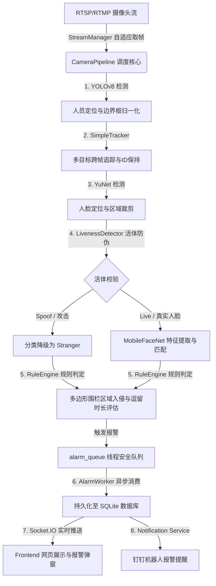

# 🛡️ OmniGuard - 智能校园安全监测与边缘端推理系统

OmniGuard 是一款专为智能校园场景设计的高性能、高安全性的实时视频流分析与边缘端推理系统。该系统集成了目标追踪、人脸识别、活体防御、多边形电子围栏检测以及异步高并发告警流水线，旨在为校园重点区域（如围墙、实验室、配电房等）提供全天候的智能化防入侵与行为分析服务。

---

## ⚙️ 系统架构设计



---

## ✨ 核心特性

### 1. 高性能实时流控制 (`StreamManager`)
* **非阻塞双缓冲读取**：开发了独立的 Frame Grab/Retrieve 工作线程，并搭配 Buffer-Flush 丢帧机制，彻底消除传统 OpenCV 读取 RTSP 视频流时的卡顿与画面延迟。
* **自适应断线重连**：内置基于指数退避（Exponential Backoff）的自动重连算法，防止因网络瞬断导致系统进程崩溃，保证边缘端 7×24 小时高可用。

### 2. 边缘端轻量级深度推理 (`ModelLoader` & `YoloDetector`)
* **模型延迟懒加载与 CPU 预热**：系统启动时异步进行 CPU 虚拟帧预热，防止冷启动时首帧推理过慢导致延迟。
* **坐标归一化转换**：YOLOv8n 模型推理坐标自动根据流分辨率缩放为 $0.0 \sim 1.0$ 的归一化浮点数，适配任何尺寸的监控画面。

### 3. 多模态安全人脸识别与防伪 (`FaceRecognizer` & `LivenessDetector`)
* **高维向量 L2 匹配**：YuNet 提取人脸区域，MobileFaceNet 生成 128 维特征向量，利用 L2 欧氏距离进行人脸识别，支持热装载人脸库。
* **混合式活体防伪**：融合 **MiniFASNetV2 ONNX 深度模型**、拉普拉斯清晰度与 HSV 色彩分布，识别照片打印、手机屏幕等二次翻拍攻击；失败或模型异常时采用 fail-closed 策略，不会把未验证人脸放行为真实身份。
* **线程安全数据缓存**：内置基于 `RLock` 的多线程读写锁，防止高并发注册人脸时内存缓存字典的竞态损坏。

### 4. 高精多边形围栏规则引擎 (`RuleEngine`)
* **射线法多边形碰撞检测**：检测物体底边中点与闭合多边形（Polygon）的关系，支持任意不规则图形作为防区。
* **高阶停留时长状态机**：监控对象进入防区后开始毫秒级计时，超过设定的 `stay_seconds` 阈值即触发报警。
* **周期性报警去重冷却**：支持全局可配置的 `ALARM_COOLDOWN_SECONDS` 窗口。对象在区域内长驻时，在此窗口内将静默重复告警，超出窗口后再次触发，兼顾不漏报与防警报刷屏。

### 5. 异步高吞吐告警流水线 (`pipeline.py`)
* **单例管线管理器 (`CameraPipelineManager`)**：全局统筹管理多路摄像头子线程的生命周期。
* **配置脏标记热加载（Dirty Reloading）**：修改电子围栏时将对应的摄像头通道置为“脏状态”，并在下一轮循环中自动重载配置，无需重启核心服务。
* **异步防阻塞持久化 (`AlarmWorker`)**：使用线程安全队列 `alarm_queue` 进行削峰填谷，在后台线程完成图片写盘、SQLite 保存、WebSocket 发射及三方通知推送。

---

## 📁 项目目录结构

```text
OmniGuard/
├── backend/                  # 后端 Flask 与推理引擎目录
│   ├── api/                  # 接口层 (AlertZone CRUD、状态健康等)
│   ├── core_cv/              # 核心计算机视觉算法库
│   │   ├── weights/          # 模型权重目录 (.pt / .onnx)
│   │   ├── __init__.py       # 包级核心 API 暴露
│   │   ├── liveness_detector.py # 活体检测器
│   │   ├── face_recognizer.py   # 人脸匹配与热刷新
│   │   ├── rule_engine.py       # 多边形围栏状态机
│   │   ├── stream_manager.py    # RTSP/Webcam 流控制
│   │   └── pipeline.py          # 调度核心 CameraPipeline & AlarmWorker
│   ├── models/               # SQLAlchemy 数据模型定义
│   ├── tests/                # 自动化测试用例集
│   ├── app.py                # 后端 Flask & SocketIO 启动入口
│   ├── config.py             # 系统环境变量与超时阈值配置
│   ├── test_camera.py        # 快速测试本地摄像头的可视化小工具
│   └── requirements.txt      # 依赖包列表
├── docs/                     # 部署与技术方案文档
│   └── user_manual.md        # 详细部署与配置用户手册
├── frontend/                 # 前端 UI 代码 (网页、Socket接收与警报板)
└── ops/                      # 部署运维自动化脚本
```

---

## 🚀 快速开始

### 1. 自动构建与一键运行 (PowerShell 推荐)
在项目根目录下，您可以直接运行：
```powershell
# 一键安装依赖并配置环境
.\setup.ps1

# 启动前后端服务
.\start-dev.ps1
```
也可以一键执行：
```powershell
.\one-click.ps1
```
*服务默认地址：前端 `http://127.0.0.1:5173`，后端健康检查 `http://127.0.0.1:5000/api/system/health`。*

### 2. 手动启动后端
```bash
# 进入后端目录
cd backend

# 创建并激活虚拟环境
python -m venv venv
venv\Scripts\activate      # Windows
source venv/bin/activate    # Linux / macOS

# 安装 Python 依赖
pip install -r requirements.txt

# 下载权重模型
python core_cv/weights/download_weights.py

# 启动 Flask & WebSocket 生产主服务
python app.py
```

### 3. 手动启动前端
```bash
# 进入前端目录
cd frontend

# 安装依赖
npm install

# 运行开发服务器
npm run dev
```

### 4. 运行全链路测试
```bash
cd backend
python tests/test_cv_pipeline.py
```

---

## 🔌 核心 API 接口简表

### 1. Zone 配置与 CRUD
*   **创建防区 (POST)**: `/api/zones`
*   **获取防区列表 (GET)**: `/api/zones`
*   **更新/删除防区 (PUT/DELETE)**: `/api/zones/<int:id>`
    *(向该 API 提交更改后，推理引擎会自动将摄像头标为 "dirty" 并触发热重载)*

### 2. 摄像头流状态监控
*   **获取摄像头运行健康指标 (GET)**: `/api/cameras/status`
