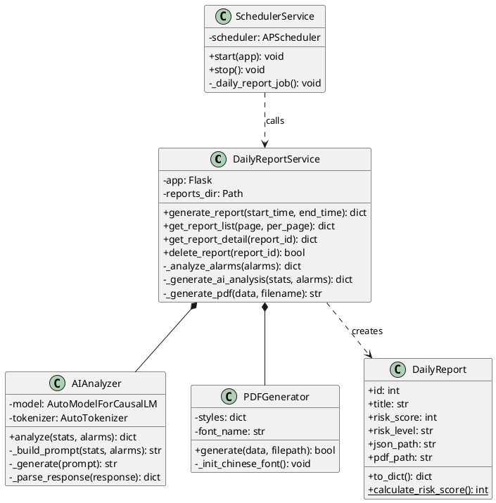
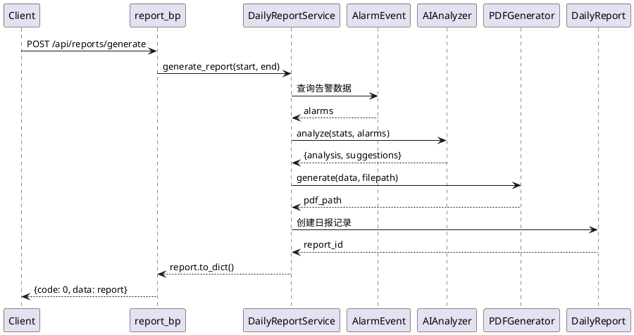

# OmniGuard AI 日报生成模块架构文档

## 概述

本文档描述 OmniGuard 智慧校园安防系统中 AI 日报生成模块的完整架构，包括类图、流程图、时序图的详细设计信息。

---

## 一、类图

### 1.1 类列表

| 类名 | 文件路径 | 职责 |
|------|----------|------|
| **DailyReportService** | services/daily_report_service.py | 日报生成核心服务 |
| **AIAnalyzer** | services/ai_analyzer.py | AI 分析器（Qwen2-1.5B） |
| **PDFGenerator** | services/pdf_generator.py | PDF 文件生成器 |
| **SchedulerService** | services/scheduler.py | 定时任务调度器 |
| **DailyReport** | models/daily_report.py | 日报数据模型 |
| **report_bp** | api/report_api.py | 日报 API 蓝图 |

### 1.2 类的属性和方法

#### DailyReportService（日报生成服务）

**属性：**
- `app`: Flask 应用实例
- `reports_dir`: 报告文件存储目录

**方法：**
- `generate_report(start_time, end_time)`: 生成日报（核心方法）
- `get_report_list(page, per_page)`: 获取日报列表（分页）
- `get_report_detail(report_id)`: 获取日报详情
- `delete_report(report_id)`: 删除日报
- `_analyze_alarms(alarms)`: 分析告警统计数据
- `_generate_ai_analysis(stats, alarms)`: 调用 AI 分析器
- `_generate_pdf(data, filename)`: 调用 PDF 生成器
- `_save_json(data, filename)`: 保存 JSON 文件
- `_get_detailed_alarm_type(alarm)`: 获取详细告警类型
- `_generate_summary(stats, risk_score, risk_level)`: 生成一句话概括
- `_generate_fallback_analysis(stats, alarms)`: 备用分析（AI 不可用时）

---

#### AIAnalyzer（AI 分析器）

**属性：**
- `model`: Qwen2-1.5B-Instruct 模型实例
- `tokenizer`: 分词器实例
- `generator`: 文本生成器

**方法：**
- `analyze(stats, alarms)`: 分析告警数据并生成报告和建议
- `_build_prompt(stats, alarms)`: 构建提示词
- `_generate(prompt)`: 调用 AI 模型生成文本
- `_parse_response(response)`: 解析 AI 响应
- `_fallback_analyze(stats, alarms)`: 备用分析（模型不可用时）

**AI 模型**：Qwen/Qwen2-1.5B-Instruct（通义千问 1.5B 参数模型）

---

#### PDFGenerator（PDF 生成器）

**属性：**
- `styles`: PDF 样式集合
- `font_name`: 中文字体名称

**方法：**
- `generate(data, filepath)`: 生成 PDF 文件
- `_init_chinese_font()`: 初始化中文字体
- `_init_styles()`: 初始化 PDF 样式

**依赖库**：ReportLab

---

#### SchedulerService（定时任务调度器）

**属性：**
- `scheduler`: APScheduler 实例
- `app`: Flask 应用实例

**方法：**
- `_setup_jobs()`: 设置定时任务
- `_daily_report_job()`: 日报生成任务（每天 6:00 执行）
- `_escalation_check_job()`: 告警升级检查（每 60 秒）
- `_heartbeat_job()`: 心跳任务（每 30 秒）
- `start(app)`: 启动调度器
- `stop()`: 停止调度器

---

#### DailyReport（日报数据模型）

**属性：**
- `id`: 日报唯一标识
- `title`: 日报标题
- `generated_at`: 生成时间
- `summary`: 一句话概括
- `risk_score`: 风险评分（0-100）
- `risk_level`: 风险等级（低/中/高）
- `start_time`: 统计开始时间
- `end_time`: 统计结束时间
- `total_alarms`: 告警总数
- `critical_alarms`: 严重告警数
- `high_alarms`: 高级告警数
- `medium_alarms`: 中级告警数
- `low_alarms`: 低级告警数
- `json_path`: JSON 文件路径
- `pdf_path`: PDF 文件路径

**方法：**
- `to_dict()`: 转换为字典格式
- `calculate_risk_score(critical, high, medium, low)`: 计算风险评分（静态方法）
- `get_risk_level(score)`: 获取风险等级（静态方法）

---

### 1.3 类之间的关系

```
┌─────────────────────────────────────────────────────────────────┐
│                           API 层                                 │
│                    report_bp (Blueprint)                         │
│                                                                  │
│  POST /api/reports/generate                                      │
│  GET  /api/reports                                               │
│  GET  /api/reports/<id>                                          │
│  DELETE /api/reports/<id>                                        │
│  GET  /api/reports/<id>/download                                 │
└──────────────────────────┬──────────────────────────────────────┘
                           │ 调用
                           ▼
┌─────────────────────────────────────────────────────────────────┐
│                          服务层                                  │
│                     DailyReportService                           │
│                                                                  │
│  - generate_report()                                             │
│  - get_report_list()                                             │
│  - get_report_detail()                                           │
│  - delete_report()                                               │
└──────────┬───────────────┬───────────────┬──────────────────────┘
           │               │               │
           ▼               ▼               ▼
┌──────────────────┐ ┌──────────────┐ ┌──────────────────────┐
│   AIAnalyzer     │ │ PDFGenerator │ │     数据模型层        │
│                  │ │              │ │                      │
│  - analyze()     │ │ - generate() │ │  - DailyReport       │
│  - _generate()   │ │              │ │  - AlarmEvent        │
└────────┬─────────┘ └──────┬───────┘ └──────────────────────┘
         │                  │
         ▼                  ▼
┌──────────────────┐ ┌──────────────┐
│    AI 模型        │ │  ReportLab   │
│ Qwen2-1.5B-Instruct│ │   (PDF 库)   │
└──────────────────┘ └──────────────┘

┌─────────────────────────────────────────────────────────────────┐
│                        定时任务层                                │
│                   SchedulerService                               │
│                                                                  │
│  - _daily_report_job() (每天 6:00)                               │
│  - _escalation_check_job() (每 60 秒)                            │
│  - _heartbeat_job() (每 30 秒)                                   │
└──────────────────────────┬──────────────────────────────────────┘
                           │ 调用
                           ▼
                  DailyReportService
```

**依赖关系总结：**

| 调用方 | 被调用方 | 关系类型 |
|--------|----------|----------|
| report_bp | DailyReportService | 依赖 |
| DailyReportService | AIAnalyzer | 组合 |
| DailyReportService | PDFGenerator | 组合 |
| DailyReportService | DailyReport/AlarmEvent | 依赖 |
| SchedulerService | DailyReportService | 依赖 |
| AIAnalyzer | Qwen2-1.5B-Instruct | 依赖 |
| PDFGenerator | ReportLab | 依赖 |

---

## 二、流程图

### 2.1 AI 日报生成主流程（带泳道）

**泳道划分：**

| 泳道 | 组件 | 职责 |
|------|------|------|
| 触发层 | API/Scheduler | 接收生成请求 |
| 数据层 | AlarmEvent | 查询告警数据 |
| 分析层 | DailyReportService | 统计分析和风险计算 |
| AI层 | AIAnalyzer | AI 分析和建议生成 |
| 文件层 | PDFGenerator | 生成 PDF 和 JSON 文件 |
| 存储层 | DailyReport | 保存数据库记录 |

**流程步骤：**

```
┌─────────────────────────────────────────────────────────────────────────────┐
│                              [开始]                                          │
└─────────────────────────────────────────────────────────────────────────────┘
                                      │
                                      ▼
┌─────────────────────────────────────────────────────────────────────────────┐
│ 【触发层】两种触发方式                                                         │
│                                                                              │
│   方式1: 定时任务                                                             │
│   SchedulerService._daily_report_job()                                       │
│   - 触发时间: 每天 6:00                                                       │
│   - 时间范围: 前一天 6:00 ~ 当天 6:00                                         │
│                                                                              │
│   方式2: API 调用                                                             │
│   POST /api/reports/generate                                                 │
│   - 支持自定义时间范围 (start_time, end_time)                                 │
└─────────────────────────────────────────────────────────────────────────────┘
                                      │
                                      ▼
┌─────────────────────────────────────────────────────────────────────────────┐
│ 【数据层】查询告警数据                                                         │
│                                                                              │
│   ① 查询 AlarmEvent 表                                                       │
│      SELECT * FROM alarm_events                                              │
│      WHERE created_at >= start_time                                          │
│        AND created_at <= end_time                                            │
│      ORDER BY created_at DESC                                                │
│                                                                              │
│   ② 返回: alarms = [AlarmEvent, ...]                                         │
└─────────────────────────────────────────────────────────────────────────────┘
                                      │
                                      ▼
┌─────────────────────────────────────────────────────────────────────────────┐
│ 【分析层】统计分析                                                             │
│                                                                              │
│   ③ _analyze_alarms(alarms)                                                 │
│      - 统计告警总数: total = len(alarms)                                     │
│      - 按类型统计: by_type = {围栏入侵告警: 5, 陌生人告警: 3, ...}            │
│      - 按严重程度统计: by_severity = {critical: 2, high: 4, medium: 3, low: 1} │
│      - 计算各级别数量: critical_count, high_count, medium_count, low_count   │
└─────────────────────────────────────────────────────────────────────────────┘
                                      │
                                      ▼
┌─────────────────────────────────────────────────────────────────────────────┐
│ 【分析层】风险评分计算                                                         │
│                                                                              │
│   ④ calculate_risk_score(critical, high, medium, low)                       │
│      score = critical × 10 + high × 7 + medium × 4 + low × 1               │
│      score = min(score, 100)  # 上限 100 分                                  │
│                                                                              │
│   ⑤ get_risk_level(score)                                                   │
│      ┌─────────────────────────────────────┐                                │
│      │ score <= 30 ?                       │                                │
│      └─────────────────────────────────────┘                                │
│              │               │                                                │
│              │ 是            │ 否                                             │
│              ▼               ▼                                                │
│         风险等级: 低    ┌─────────────────────────────────────┐              │
│                        │ score <= 60 ?                       │              │
│                        └─────────────────────────────────────┘              │
│                                │               │                            │
│                                │ 是            │ 否                         │
│                                ▼               ▼                            │
│                           风险等级: 中      风险等级: 高                     │
└─────────────────────────────────────────────────────────────────────────────┘
                                      │
                                      ▼
┌─────────────────────────────────────────────────────────────────────────────┐
│ 【分析层】生成一句话概括                                                       │
│                                                                              │
│   ⑥ _generate_summary(stats, risk_score, risk_level)                        │
│      示例: "过去24小时内共发生10次安全告警，                                   │
│             主要类型为围栏入侵告警、陌生人告警，                                │
│             风险评分35分，风险等级：中"                                        │
└─────────────────────────────────────────────────────────────────────────────┘
                                      │
                                      ▼
┌─────────────────────────────────────────────────────────────────────────────┐
│ 【AI层】AI 分析                                                               │
│                                                                              │
│   ⑦ _generate_ai_analysis(stats, alarms)                                    │
│      → AIAnalyzer.analyze(stats, alarms)                                     │
│                                                                              │
│      a) _build_prompt() - 构建提示词                                          │
│         包含: 告警统计、类型分布、严重程度分布、最近告警详情                    │
│                                                                              │
│      b) _generate() - 调用 Qwen2-1.5B-Instruct                               │
│         - 编码输入: inputs = tokenizer(prompt)                               │
│         - 生成输出: outputs = model.generate(**inputs)                       │
│         - 解码输出: response = tokenizer.decode(outputs)                     │
│                                                                              │
│      c) _parse_response() - 解析 AI 响应                                      │
│         提取【分析】和【建议】部分                                             │
│                                                                              │
│   ⑧ 返回: {analysis: [...], suggestions: [...]}                             │
│                                                                              │
│   注: 如果 AI 模型不可用，自动调用 _fallback_analyze()                        │
└─────────────────────────────────────────────────────────────────────────────┘
                                      │
                                      ▼
┌─────────────────────────────────────────────────────────────────────────────┐
│ 【文件层】保存文件                                                             │
│                                                                              │
│   ⑨ _save_json(report_data, filename)                                        │
│      - 文件名: report_YYYYMMDD_HHMMSS.json                                   │
│      - 路径: /static/reports/report_YYYYMMDD_HHMMSS.json                     │
│      - 内容: 完整的日报数据（JSON 格式）                                       │
│                                                                              │
│   ⑩ _generate_pdf(report_data, filename)                                     │
│      → PDFGenerator.generate(data, filepath)                                 │
│      - 文件名: report_YYYYMMDD_HHMMSS.pdf                                    │
│      - 路径: /static/reports/report_YYYYMMDD_HHMMSS.pdf                      │
│      - 内容:                                                                 │
│        1. 标题和生成时间                                                      │
│        2. 监控概况（时长、告警总数、风险评分、风险等级）                        │
│        3. 告警事件统计（按类型、按严重程度）                                   │
│        4. 详细告警列表（最多 20 条）                                          │
│        5. 安全分析（AI 生成）                                                 │
│        6. 改进建议（AI 生成）                                                 │
└─────────────────────────────────────────────────────────────────────────────┘
                                      │
                                      ▼
┌─────────────────────────────────────────────────────────────────────────────┐
│ 【存储层】保存数据库记录                                                       │
│                                                                              │
│   ⑪ 创建 DailyReport 记录                                                    │
│      report = DailyReport(                                                   │
│          title='校园安全日报',                                                │
│          generated_at=end_time,                                              │
│          summary=summary,                                                    │
│          risk_score=risk_score,                                              │
│          risk_level=risk_level,                                              │
│          start_time=start_time,                                              │
│          end_time=end_time,                                                  │
│          total_alarms=len(alarms),                                           │
│          critical_alarms=alarm_stats['critical_count'],                      │
│          high_alarms=alarm_stats['high_count'],                              │
│          medium_alarms=alarm_stats['medium_count'],                          │
│          low_alarms=alarm_stats['low_count'],                                │
│          json_path=json_path,                                                │
│          pdf_path=pdf_path                                                   │
│      )                                                                       │
│                                                                              │
│   ⑫ 提交到数据库                                                             │
│      db.session.add(report)                                                  │
│      db.session.commit()                                                     │
└─────────────────────────────────────────────────────────────────────────────┘
                                      │
                                      ▼
┌─────────────────────────────────────────────────────────────────────────────┐
│                              [结束]                                          │
│                                                                              │
│   返回: report.to_dict()                                                     │
│   包含: 日报 ID、风险评分、文件路径等信息                                      │
└─────────────────────────────────────────────────────────────────────────────┘
```

---

### 2.2 AI 分析子流程

```
┌─────────────────────────────────────────────────────────────────────────────┐
│              [开始: AIAnalyzer.analyze(stats, alarms)]                       │
└─────────────────────────────────────────────────────────────────────────────┘
                                      │
                                      ▼
┌─────────────────────────────────────────────────────────────────────────────┐
│ <AI 模型是否可用?>                                                            │
│    (self.model is not None)                                                  │
└─────────────────────────────────────────────────────────────────────────────┘
                    │                                       │
                    │ 是                                    │ 否
                    ▼                                       ▼
┌─────────────────────────────────────────┐   ┌─────────────────────────────────┐
│ Step 1: 构建提示词                        │   │ 直接调用备用分析                 │
│ prompt = _build_prompt(stats, alarms)    │   │ _fallback_analyze(stats, alarms) │
│                                          │   │                                 │
│ 提示词内容:                               │   │ 返回:                           │
│ - 过去24小时告警统计                       │   │ {                               │
│ - 按类型统计                               │   │   analysis: [...],              │
│ - 按严重程度统计                           │   │   suggestions: [...]            │
│ - 最近告警详情（前10条）                   │   │ }                               │
│ - 任务要求: 分析 + 建议                    │   │                                 │
└─────────────────────────────────────────┘   └─────────────────────────────────┘
                    │
                    ▼
┌─────────────────────────────────────────┐
│ Step 2: 调用 AI 模型生成文本              │
│ response = _generate(prompt)             │
│                                          │
│ a) 编码输入:                              │
│    inputs = tokenizer(prompt,            │
│              return_tensors="pt")        │
│                                          │
│ b) 生成输出:                              │
│    outputs = model.generate(             │
│        **inputs,                         │
│        max_new_tokens=512,               │
│        temperature=0.7,                  │
│        top_p=0.9,                        │
│        do_sample=True                    │
│    )                                     │
│                                          │
│ c) 解码输出:                              │
│    response = tokenizer.decode(          │
│        outputs[0],                       │
│        skip_special_tokens=True          │
│    )                                     │
│    response = response[len(prompt):]     │
└─────────────────────────────────────────┘
                    │
                    ▼
┌─────────────────────────────────────────┐
│ Step 3: 解析 AI 响应                      │
│ result = _parse_response(response)       │
│                                          │
│ 提取格式:                                 │
│ 【分析】                                  │
│ 1. ...                                   │
│ 2. ...                                   │
│                                          │
│ 【建议】                                  │
│ 1. ...                                   │
│ 2. ...                                   │
└─────────────────────────────────────────┘
                    │
                    ▼
┌─────────────────────────────────────────┐
│ 返回: {                                  │
│   analysis: [...],                       │
│   suggestions: [...]                     │
│ }                                        │
└─────────────────────────────────────────┘
                    │
                    ▼
┌─────────────────────────────────────────────────────────────────────────────┐
│                              [结束]                                          │
└─────────────────────────────────────────────────────────────────────────────┘
```

---

## 三、时序图

### 3.1 API 触发日报生成时序

**参与者：**
- Client: 客户端（前端/定时任务）
- report_bp: 日报 API 蓝图
- DailyReportService: 日报生成服务
- AlarmEvent: 告警数据模型
- AIAnalyzer: AI 分析器
- PDFGenerator: PDF 生成器
- DailyReport: 日报数据模型

**时序：**

```
┌────────┐ ┌──────────┐ ┌──────────────────┐ ┌───────────┐ ┌───────────┐ ┌────────────┐ ┌───────────┐
│ Client │ │ report_bp │ │DailyReportService│ │ AlarmEvent│ │ AIAnalyzer│ │PDFGenerator│ │DailyReport│
└───┬────┘ └────┬─────┘ └────────┬─────────┘ └─────┬─────┘ └─────┬─────┘ └─────┬──────┘ └─────┬─────┘
    │           │                │                 │             │             │              │
    │ POST /api/reports/generate │                 │             │             │              │
    │──────────>│                │                 │             │             │              │
    │           │                │                 │             │             │              │
    │           │ generate_report(start, end)      │             │             │              │
    │           │───────────────>│                 │             │             │              │
    │           │                │                 │             │             │              │
    │           │                │ 查询告警数据     │             │             │              │
    │           │                │────────────────>│             │             │              │
    │           │                │                 │             │             │              │
    │           │                │ alarms          │             │             │              │
    │           │                │<────────────────│             │             │              │
    │           │                │                 │             │             │              │
    │           │                │ analyze(stats, alarms)        │             │              │
    │           │                │───────────────────────────────>│             │              │
    │           │                │                 │             │             │              │
    │           │                │                 │             │ _generate() │              │
    │           │                │                 │             │─────────────>│              │
    │           │                │                 │             │             │              │
    │           │                │ {analysis, suggestions}        │             │              │
    │           │                │<───────────────────────────────│             │              │
    │           │                │                 │             │             │              │
    │           │                │ generate(data, filepath)       │             │              │
    │           │                │─────────────────────────────────────────────>│              │
    │           │                │                 │             │             │              │
    │           │                │ pdf_path        │             │             │              │
    │           │                │<─────────────────────────────────────────────│              │
    │           │                │                 │             │             │              │
    │           │                │ 创建日报记录     │             │             │              │
    │           │                │─────────────────────────────────────────────────────────────>│
    │           │                │                 │             │             │              │
    │           │                │ report_id       │             │             │              │
    │           │                │<─────────────────────────────────────────────────────────────│
    │           │                │                 │             │             │              │
    │           │ report.to_dict()│                │             │             │              │
    │           │<───────────────│                 │             │             │              │
    │           │                │                 │             │             │              │
    │ {code: 0, data: report}    │                 │             │             │              │
    │<──────────│                │                 │             │             │              │
    │           │                │                 │             │             │              │
    ▼           ▼                ▼                 ▼             ▼             ▼              ▼
```

---

### 3.2 定时任务触发日报生成时序

**参与者：**
- SchedulerService: 定时任务调度器
- DailyReportService: 日报生成服务
- AlarmEvent: 告警数据模型
- AIAnalyzer: AI 分析器
- PDFGenerator: PDF 生成器
- DailyReport: 日报数据模型

**时序：**

```
┌─────────────────┐ ┌──────────────────┐ ┌───────────┐ ┌───────────┐ ┌────────────┐ ┌───────────┐
│SchedulerService │ │DailyReportService│ │ AlarmEvent│ │ AIAnalyzer│ │PDFGenerator│ │DailyReport│
└────────┬────────┘ └────────┬─────────┘ └─────┬─────┘ └─────┬─────┘ └─────┬──────┘ └─────┬─────┘
         │                   │                 │             │             │              │
         │ 定时触发 (每天6:00)│                 │             │             │              │
         │                   │                 │             │             │              │
         │ _daily_report_job()│                 │             │             │              │
         │──────────────────>│                 │             │             │              │
         │                   │                 │             │             │              │
         │                   │ 计算时间范围      │             │             │              │
         │                   │ start = 昨天6:00 │             │             │              │
         │                   │ end = 今天6:00   │             │             │              │
         │                   │                 │             │             │              │
         │                   │ generate_report(start, end)    │             │              │
         │                   │ (后续流程同上)   │             │             │              │
         │                   │                 │             │             │              │
         ▼                   ▼                 ▼             ▼             ▼              ▼
```

---

## 四、关键技术特性

### 4.1 AI 模型配置

| 配置项 | 值 | 说明 |
|--------|-----|------|
| 模型名称 | Qwen/Qwen2-1.5B-Instruct | 通义千问 1.5B 参数模型 |
| 最大生成长度 | 512 tokens | 控制输出长度 |
| 温度参数 | 0.7 | 控制生成随机性 |
| Top-p | 0.9 | Nucleus sampling |
| 设备映射 | auto | 自动选择 CPU/GPU |

### 4.2 风险评分算法

```
风险评分 = min(critical × 10 + high × 7 + medium × 4 + low × 1, 100)

风险等级判断：
- 评分 ≤ 30: 低风险
- 评分 ≤ 60: 中风险
- 评分 > 60: 高风险
```

### 4.3 定时任务配置

| 任务名称 | 触发方式 | 执行时间 | 说明 |
|----------|----------|----------|------|
| 日报生成 | Cron | 每天 6:00 | 自动生成前一天日报 |
| 告警升级检查 | Interval | 每 60 秒 | 检查待升级告警 |
| 心跳 | Interval | 每 30 秒 | 系统健康检查 |

### 4.4 文件存储结构

```
backend/
└── static/
    └── reports/
        ├── report_20260713_060000.json
        ├── report_20260713_060000.pdf
        ├── report_20260714_060000.json
        └── report_20260714_060000.pdf
```

### 4.5 容错机制

| 场景 | 处理方式 |
|------|----------|
| AI 模型不可用 | 自动切换到备用分析（基于规则） |
| PDF 生成失败 | pdf_path 设为 None，日报仍保存 |
| 数据库查询失败 | 返回错误信息，不生成日报 |
| 模型下载失败 | 使用 HuggingFace 镜像重试 |

---

## 五、API 接口说明

### 5.1 接口列表

| 方法 | 路径 | 说明 |
|------|------|------|
| POST | /api/reports/generate | 生成日报 |
| GET | /api/reports | 获取日报列表 |
| GET | /api/reports/\<id\> | 获取日报详情 |
| DELETE | /api/reports/\<id\> | 删除日报 |
| GET | /api/reports/\<id\>/download | 下载日报 PDF |

### 5.2 请求/响应示例

**生成日报：**
```json
// POST /api/reports/generate
// Request
{
  "start_time": "2026-07-12T06:00:00",
  "end_time": "2026-07-13T06:00:00"
}

// Response
{
  "code": 0,
  "message": "日报生成成功",
  "data": {
    "id": 1,
    "title": "校园安全日报",
    "generated_at": "2026-07-13T06:00:00Z",
    "summary": "过去24小时内共发生10次安全告警...",
    "risk_score": 35,
    "risk_level": "中",
    "total_alarms": 10,
    "json_path": "/static/reports/report_20260713_060000.json",
    "pdf_path": "/static/reports/report_20260713_060000.pdf"
  }
}
```

---

## 六、附录：PlantUML 代码示例

### 6.1 类图



### 6.2 时序图



---

**文档版本**: v1.0  
**最后更新**: 2026-07-13  
**作者**: OmniGuard 开发团队