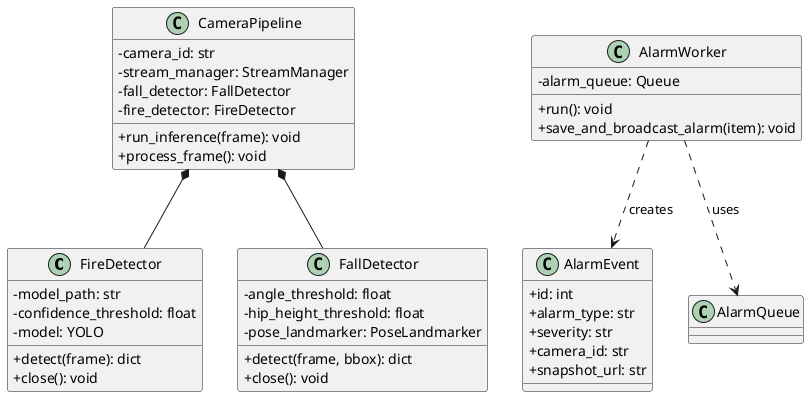
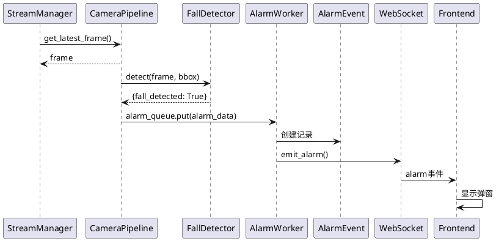

# OmniGuard 异常行为检测模块架构文档

## 概述

本文档描述 OmniGuard 智慧校园安防系统中异常行为检测模块（火情和跌倒）的完整架构，包括类图、流程图、时序图的详细设计信息。

---

## 一、类图

### 1.1 类列表

| 类名 | 文件路径 | 职责 |
|------|----------|------|
| **FireDetector** | core_cv/fire_detector.py | 火情检测器，支持 YOLOv8 和颜色检测两种方式 |
| **FallDetector** | core_cv/fall_detector.py | 跌倒检测器，基于 MediaPipe 姿态估计 |
| **YoloDetector** | core_cv/yolo_detector.py | 人物检测器，为跌倒检测提供目标边界框 |
| **StreamManager** | core_cv/stream_manager.py | 视频流管理，异步读取视频帧 |
| **CameraPipeline** | core_cv/pipeline.py | 单摄像头处理管道，协调各检测器 |
| **CameraPipelineManager** | core_cv/pipeline.py | 管道管理器（单例），管理所有摄像头管道 |
| **AlarmWorker** | core_cv/pipeline.py | 告警处理工作线程，消费告警队列 |
| **AlarmEvent** | models/alarm.py | 告警数据模型，存储告警记录 |
| **AlertEventHandler** | services/alert_handler.py | 告警事件处理器，判断告警级别 |
| **DingTalkAlertService** | services/dingtalk_alert.py | 钉钉告警服务，发送通知和逐级上报 |

### 1.2 类的属性和方法

#### FireDetector（火情检测器）

**属性：**
- `model_path`: YOLOv8 模型路径
- `confidence_threshold`: 置信度阈值
- `model`: YOLOv8 模型实例

**方法：**
- `detect(frame)`: 执行火情检测，返回检测结果字典
- `_detect_with_yolo(frame)`: 使用 YOLOv8 模型检测火情和烟雾
- `_detect_with_color(frame)`: 使用 HSV 颜色空间检测火情（后备方案）
- `close()`: 关闭检测器，释放资源

---

#### FallDetector（跌倒检测器）

**属性：**
- `angle_threshold`: 身体倾斜角度阈值（默认 45°）
- `hip_height_threshold`: 髋部高度阈值（默认 0.3）
- `confidence_threshold`: 置信度阈值
- `pose_landmarker`: MediaPipe 姿态估计器实例

**方法：**
- `detect(frame, bbox)`: 执行跌倒检测，可传入人物边界框
- `_analyze_pose(landmarks)`: 分析姿态关键点判断是否跌倒
- `_get_midpoint(point1, point2)`: 计算两点中点
- `_calculate_angle_from_vertical(point1, point2)`: 计算身体倾斜角度
- `close()`: 关闭检测器

---

#### CameraPipeline（摄像头处理管道）

**属性：**
- `camera_id`: 摄像头标识
- `stream_manager`: 视频流管理器
- `yolo_detector`: 人物检测器
- `fall_detector`: 跌倒检测器
- `fire_detector`: 火情检测器
- `alarm_queue`: 告警队列（全局共享）

**方法：**
- `run_inference(frame)`: 执行完整的 AI 推理流程
- `process_frame()`: 处理单帧（读取→推理→绘制→保存）
- `update_zones(zones)`: 更新围栏配置
- `release()`: 释放所有资源

---

#### AlarmWorker（告警工作线程）

**属性：**
- `alarm_queue`: 告警队列
- `running`: 运行状态标志

**方法：**
- `run()`: 线程主循环，从队列消费告警
- `save_and_broadcast_alarm(item)`: 保存告警并广播推送

---

#### AlarmEvent（告警数据模型）

**属性：**
- `id`: 告警唯一标识
- `alarm_type`: 告警类型（fall/fire/electronic_fence/stranger）
- `severity`: 严重程度（critical/high/medium/low）
- `camera_id`: 摄像头 ID
- `snapshot_url`: 快照图片路径
- `description`: 告警描述
- `status`: 状态（pending/resolved/false_positive）
- `created_at`: 创建时间

**方法：**
- `to_dict()`: 转换为字典格式
- `should_escalate()`: 判断是否需要逐级上报
- `escalate()`: 执行逐级上报

---

### 1.3 类之间的关系

```
┌─────────────────────────────────────────────────────────────────┐
│                    CameraPipelineManager (单例)                  │
│                           [1]                                    │
│                            │                                     │
│              ┌─────────────┼─────────────┐                      │
│              │             │             │                       │
│              ▼             ▼             ▼                       │
│     FaceRecognizer  RuleEngine   CameraPipeline[*]              │
│                                      [组合]                      │
│                                         │                        │
│                    ┌────────────────────┼───────────────────┐   │
│                    │                    │                   │    │
│                    ▼                    ▼                   ▼    │
│             StreamManager[1]    YoloDetector[1]    FallDetector[1] │
│                 [组合]              [组合]            [组合]     │
│                                                               │
│                                          FireDetector[1]      │
│                                              [组合]            │
└─────────────────────────────────────────────────────────────────┘

┌─────────────────────────────────────────────────────────────────┐
│                         AlarmWorker                              │
│                            [1]                                   │
│                             │                                    │
│              ┌──────────────┼──────────────┐                    │
│              │              │              │                     │
│              ▼              ▼              ▼                     │
│        alarm_queue    AlarmEvent    ws_handler                  │
│          [依赖]        [依赖]        [依赖]                      │
│                                                                │
│       AlertEventHandler                                        │
│            [依赖]                                              │
│              │                                                 │
│              ▼                                                 │
│     DingTalkAlertService[1]                                    │
│          [组合]                                                │
└─────────────────────────────────────────────────────────────────┘
```

**关系类型说明：**

| 关系类型 | 符号 | 说明 | 示例 |
|----------|------|------|------|
| 组合 | 实心菱形 | 强拥有关系，生命周期一致 | CameraPipeline 包含 StreamManager |
| 依赖 | 虚线箭头 | 使用关系，通过参数或调用使用 | AlarmWorker 使用 alarm_queue |
| 关联 | 实线箭头 | 弱拥有关系，生命周期独立 | AlertEventHandler 关联 AlarmEvent |

---

## 二、流程图

### 2.1 异常行为检测主流程

**泳道划分：**

| 泳道 | 组件 | 职责 |
|------|------|------|
| 视频采集层 | StreamManager | 连接视频源，异步读取帧 |
| AI推理层 | CameraPipeline, Detectors | 执行目标检测和异常行为检测 |
| 告警处理层 | AlarmWorker, AlarmEvent | 保存告警记录到数据库 |
| 通知推送层 | WebSocket, DingTalkService | 推送告警到前端和钉钉 |
| 前端展示层 | Vue Components | 显示告警弹窗和列表 |

**流程步骤：**

```
┌─────────────────────────────────────────────────────────────────────────────┐
│                              [开始]                                          │
└─────────────────────────────────────────────────────────────────────────────┘
                                      │
                                      ▼
┌─────────────────────────────────────────────────────────────────────────────┐
│ 【视频采集层】StreamManager                                                   │
│                                                                              │
│   ① 连接视频源（本地摄像头/RTSP/RTMP流）                                      │
│   ② 启动后台线程异步读取视频帧                                                │
│   ③ 将帧存入双缓冲区                                                         │
│   ④ get_latest_frame() → frame                                              │
└─────────────────────────────────────────────────────────────────────────────┘
                                      │
                                      ▼
┌─────────────────────────────────────────────────────────────────────────────┐
│ 【AI推理层】CameraPipeline.run_inference(frame)                              │
│                                                                              │
│   ⑤ YoloDetector.detect(frame) → 检测所有人物                               │
│      └─ 返回: persons = [{bbox, confidence, track_id}, ...]                 │
│                                                                              │
│   ⑥ 遍历每个检测到的人物:                                                    │
│      for person in persons:                                                 │
│          FallDetector.detect(frame, person.bbox) → fall_result              │
│          if fall_result.fall_detected:                                      │
│              创建跌倒告警数据                                                 │
│                                                                              │
│   ⑦ FireDetector.detect(frame) → fire_result                                │
│      if fire_result.fire_detected or fire_result.smoke_detected:            │
│          创建火情告警数据                                                     │
└─────────────────────────────────────────────────────────────────────────────┘
                                      │
                                      ▼
┌─────────────────────────────────────────────────────────────────────────────┐
│ 【AI推理层】告警过滤与入队                                                    │
│                                                                              │
│   ⑧ 检查告警冷却期（30秒内同类告警不重复触发）                                │
│      ┌─────────────────────────────────────┐                                │
│      │ 是否在冷却期内？                     │                                │
│      └─────────────────────────────────────┘                                │
│              │                               │                               │
│              │ 是                            │ 否                            │
│              ▼                               ▼                               │
│         [跳过告警]              alarm_queue.put_nowait(alarm_data)          │
└─────────────────────────────────────────────────────────────────────────────┘
                                      │
                                      ▼
┌─────────────────────────────────────────────────────────────────────────────┐
│ 【告警处理层】AlarmWorker.save_and_broadcast_alarm(item)                     │
│                                                                              │
│   ⑨ 保存快照图片:                                                            │
│      filename = f"alarm_{alarm_id}_{timestamp}.jpg"                         │
│      cv2.imwrite(f"static/snapshots/{filename}", snapshot_frame)            │
│                                                                              │
│   ⑩ 创建 AlarmEvent 数据库记录:                                              │
│      alarm = AlarmEvent(                                                    │
│          alarm_type="异常活动告警",                                          │
│          severity=severity,                                                 │
│          camera_id=camera_id,                                               │
│          snapshot_url=snapshot_path,                                        │
│          description="检测到跌倒/火情"                                       │
│      )                                                                       │
│      db.session.add(alarm)                                                  │
│      db.session.commit()                                                    │
└─────────────────────────────────────────────────────────────────────────────┘
                                      │
                                      ▼
┌─────────────────────────────────────────────────────────────────────────────┐
│ 【通知推送层】                                                                │
│                                                                              │
│   ⑪ WebSocket 推送:                                                          │
│      emit_alarm(alarm.to_dict())                                            │
│      → socketio.emit('alarm', alarm_dict)                                   │
│      → socketio.emit('alarm:new', alarm_dict)                               │
│                                                                              │
│   ⑫ 钉钉通知:                                                                │
│      DingTalkAlertService.send_alert(                                       │
│          alert_id=f"db_event_{alarm.id}",                                   │
│          alert_level=severity,                                              │
│          alert_type=alarm_type,                                             │
│          alert_message=description                                          │
│      )                                                                       │
│      → 根据告警类型确定责任人                                                 │
│      → 发送钉钉消息并 @责任人                                                 │
└─────────────────────────────────────────────────────────────────────────────┘
                                      │
                                      ▼
┌─────────────────────────────────────────────────────────────────────────────┐
│ 【前端展示层】                                                                │
│                                                                              │
│   ⑬ WebSocket 接收 alarm 事件                                                │
│   ⑭ alarmsStore.receiveAlarm(alarm)                                         │
│      → 更新 popup 状态（触发弹窗）                                           │
│      → 更新 items 列表                                                       │
│   ⑲ AlarmPopup.vue 显示告警弹窗                                              │
│   ⑳ AlarmHistory.vue 更新告警列表                                            │
└─────────────────────────────────────────────────────────────────────────────┘
                                      │
                                      ▼
┌─────────────────────────────────────────────────────────────────────────────┐
│                              [结束]                                          │
└─────────────────────────────────────────────────────────────────────────────┘
```

---

### 2.2 跌倒检测子流程

```
┌─────────────────────────────────────────────────────────────────────────────┐
│              [开始: FallDetector.detect(frame, bbox)]                        │
└─────────────────────────────────────────────────────────────────────────────┘
                                      │
                                      ▼
┌─────────────────────────────────────────────────────────────────────────────┐
│ ① 裁剪人物区域                                                               │
│    person_roi = frame[y1:y2, x1:x2]                                          │
└─────────────────────────────────────────────────────────────────────────────┘
                                      │
                                      ▼
┌─────────────────────────────────────────────────────────────────────────────┐
│ ② MediaPipe 姿态估计                                                         │
│    result = pose_landmarker.detect(person_roi)                              │
│    landmarks = result.pose_landmarks                                        │
└─────────────────────────────────────────────────────────────────────────────┘
                                      │
                                      ▼
┌─────────────────────────────────────────────────────────────────────────────┐
│ ③ 提取关键点                                                                 │
│    - left_shoulder, right_shoulder (肩膀)                                   │
│    - left_hip, right_hip (髋部)                                             │
│    - left_knee, right_knee (膝盖)                                           │
│    - left_ankle, right_ankle (脚踝)                                         │
└─────────────────────────────────────────────────────────────────────────────┘
                                      │
                                      ▼
┌─────────────────────────────────────────────────────────────────────────────┐
│ ④ 分析姿态 (_analyze_pose)                                                   │
│                                                                              │
│    a) 计算身体倾斜角度:                                                       │
│       shoulder_center = midpoint(left_shoulder, right_shoulder)             │
│       hip_center = midpoint(left_hip, right_hip)                            │
│       angle = calculate_angle_from_vertical(shoulder_center, hip_center)    │
│                                                                              │
│    b) 计算髋部相对高度:                                                       │
│       hip_height = hip_center.y / image_height                              │
│                                                                              │
│    c) 计算肩宽/髋宽比例:                                                      │
│       shoulder_width = distance(left_shoulder, right_shoulder)              │
│       hip_width = distance(left_hip, right_hip)                             │
│       ratio = shoulder_width / hip_width                                    │
└─────────────────────────────────────────────────────────────────────────────┘
                                      │
                                      ▼
┌─────────────────────────────────────────────────────────────────────────────┐
│ ⑤ 判断跌倒条件                                                               │
│                                                                              │
│    condition_count = 0                                                       │
│                                                                              │
│    ┌─────────────────────────────────────┐                                  │
│    │ 角度 > 45° ?                         │                                  │
│    └─────────────────────────────────────┘                                  │
│            │               │                                                │
│            │ 是            │ 否                                             │
│            ▼               │                                                │
│    condition_count++       │                                                │
│            │               │                                                │
│            └───────────────┤                                                │
│                            │                                                │
│    ┌─────────────────────────────────────┐                                  │
│    │ 髋部高度 < 0.3 ?                     │                                  │
│    └─────────────────────────────────────┘                                  │
│            │               │                                                │
│            │ 是            │ 否                                             │
│            ▼               │                                                │
│    condition_count++       │                                                │
│            │               │                                                │
│            └───────────────┤                                                │
│                            │                                                │
│    ┌─────────────────────────────────────┐                                  │
│    │ 肩髋比例异常 ?                        │                                  │
│    └─────────────────────────────────────┘                                  │
│            │               │                                                │
│            │ 是            │ 否                                             │
│            ▼               │                                                │
│    condition_count++       │                                                │
│                            │                                                │
│                            ▼                                                │
└─────────────────────────────────────────────────────────────────────────────┘
                                      │
                                      ▼
┌─────────────────────────────────────────────────────────────────────────────┐
│ ⑥ 最终判断                                                                   │
│                                                                              │
│    ┌─────────────────────────────────────┐                                  │
│    │ condition_count >= 2 ?              │                                  │
│    └─────────────────────────────────────┘                                  │
│            │               │                                                │
│            │ 是            │ 否                                             │
│            ▼               ▼                                                │
│    return {              return {                                           │
│        fall_detected: True,    fall_detected: False,                        │
│        confidence: 0.9,        confidence: 0.0                              │
│        landmarks: landmarks    }                                            │
│    }                                                                         │
└─────────────────────────────────────────────────────────────────────────────┘
                                      │
                                      ▼
┌─────────────────────────────────────────────────────────────────────────────┐
│                              [结束]                                          │
└─────────────────────────────────────────────────────────────────────────────┘
```

---

### 2.3 火情检测子流程

```
┌─────────────────────────────────────────────────────────────────────────────┐
│              [开始: FireDetector.detect(frame)]                              │
└─────────────────────────────────────────────────────────────────────────────┘
                                      │
                                      ▼
┌─────────────────────────────────────────────────────────────────────────────┐
│                     YOLOv8 模型是否可用？                                    │
│                    (fire_yolov8n.pt 存在)                                    │
└─────────────────────────────────────────────────────────────────────────────┘
                    │                                       │
                    │ 是                                    │ 否
                    ▼                                       ▼
┌─────────────────────────────────┐       ┌─────────────────────────────────┐
│ 方法A: _detect_with_yolo(frame)  │       │ 方法B: _detect_with_color(frame) │
│                                  │       │                                  │
│ ① YOLO 推理:                     │       │ ① 转换到 HSV 颜色空间:           │
│    results = model(frame)        │       │    hsv = cv2.cvtColor(frame,    │
│                                  │       │              cv2.COLOR_BGR2HSV) │
│ ② 过滤目标类别:                   │       │                                  │
│    for det in results:          │       │ ② 定义火情颜色范围:               │
│        if det.class in ['fire', │       │    - 红色: H∈[0,10]∪[170,180]    │
│                        'smoke']:│       │    - 橙色: H∈[10,25]             │
│            detections.append()  │       │    - 黄色: H∈[25,35]             │
│                                  │       │                                  │
│ ③ 统计检测结果:                   │       │ ③ 计算火情像素比例:               │
│    fire_detected = any(d.class  │       │    fire_mask = cv2.inRange(      │
│                    == 'fire')   │       │        hsv, lower, upper)        │
│    smoke_detected = any(d.class │       │    fire_pixels = cv2.countNonZero│
│                     == 'smoke') │       │        (fire_mask)               │
│                                  │       │    ratio = fire_pixels /         │
│ ④ 返回结果:                       │       │            total_pixels          │
│    return {                      │       │                                  │
│        fire_detected,            │       │ ④ 判断是否检测到火情:             │
│        smoke_detected,           │       │    fire_detected = ratio > 0.05  │
│        detections,               │       │                                  │
│        confidence                │       │ ⑤ 返回结果:                       │
│    }                             │       │    return {                      │
│                                  │       │        fire_detected,            │
│                                  │       │        ratio,                    │
│                                  │       │        detections: []            │
│                                  │       │    }                             │
└─────────────────────────────────┘       └─────────────────────────────────┘
                    │                                       │
                    └───────────────────┬───────────────────┘
                                        │
                                        ▼
┌─────────────────────────────────────────────────────────────────────────────┐
│                              [结束]                                          │
└─────────────────────────────────────────────────────────────────────────────┘
```

---

## 三、时序图

### 3.1 跌倒告警完整时序

**参与者：**
- StreamManager: 视频流管理器
- CameraPipeline: 摄像头处理管道
- FallDetector: 跌倒检测器
- AlarmWorker: 告警工作线程
- AlarmEvent: 告警数据模型（数据库）
- WebSocket: WebSocket 推送服务
- DingTalkService: 钉钉告警服务
- Frontend: 前端应用

**时序：**

```
┌─────────────┐ ┌──────────────┐ ┌────────────┐ ┌────────────┐ ┌───────────┐ ┌─────────┐ ┌───────────────┐ ┌──────────┐
│StreamManager│ │CameraPipeline│ │FallDetector│ │ AlarmWorker│ │ AlarmEvent│ │WebSocket│ │DingTalkService│ │ Frontend │
└──────┬──────┘ └──────┬───────┘ └─────┬──────┘ └─────┬──────┘ └─────┬─────┘ └────┬────┘ └───────┬───────┘ └────┬─────┘
       │               │                │              │              │            │              │              │
       │ get_latest_frame()             │              │              │            │              │              │
       │──────────────>│                │              │              │            │              │              │
       │               │                │              │              │            │              │              │
       │ frame         │                │              │              │            │              │              │
       │<──────────────│                │              │              │            │              │              │
       │               │                │              │              │            │              │              │
       │               │ run_inference(frame)          │              │            │              │              │
       │               │───────────────>│              │              │            │              │              │
       │               │                │              │              │            │              │              │
       │               │                │ detect(frame, bbox)         │            │              │              │
       │               │                │─────────────>│              │            │              │              │
       │               │                │              │              │            │              │              │
       │               │                │ {fall_detected: True}        │            │              │              │
       │               │                │<─────────────│              │            │              │              │
       │               │                │              │              │            │              │              │
       │               │ alarm_data     │              │              │            │              │              │
       │               │<───────────────│              │              │            │              │              │
       │               │                │              │              │            │              │              │
       │               │ alarm_queue.put(alarm_data)  │              │            │              │              │
       │               │──────────────────────────────>│              │            │              │              │
       │               │                │              │              │            │              │              │
       │               │                │              │ save_and_broadcast()       │              │              │
       │               │                │              │─────────────>│            │              │              │
       │               │                │              │              │            │              │              │
       │               │                │              │ 创建记录      │            │              │              │
       │               │                │              │─────────────>│            │              │              │
       │               │                │              │              │            │              │              │
       │               │                │              │ alarm_id     │            │              │              │
       │               │                │              │<─────────────│            │              │              │
       │               │                │              │              │            │              │              │
       │               │                │              │ emit_alarm() │            │              │              │
       │               │                │              │──────────────────────────>│              │              │
       │               │                │              │              │            │              │              │
       │               │                │              │ send_alert() │            │              │              │
       │               │                │              │────────────────────────────────────────>│              │
       │               │                │              │              │            │              │              │
       │               │                │              │              │            │ alarm事件    │              │
       │               │                │              │              │            │─────────────────────────────────────>│
       │               │                │              │              │            │              │              │
       │               │                │              │              │            │              │              │ 显示弹窗
       │               │                │              │              │            │              │              │
       ▼               ▼                ▼              ▼              ▼            ▼              ▼              ▼
```

---

### 3.2 火情告警时序

**参与者：**
- CameraPipeline: 摄像头处理管道
- FireDetector: 火情检测器
- AlarmWorker: 告警工作线程
- AlarmEvent: 告警数据模型
- WebSocket: WebSocket 推送服务
- DingTalkService: 钉钉告警服务
- Frontend: 前端应用

**时序：**

```
┌──────────────┐ ┌────────────┐ ┌────────────┐ ┌───────────┐ ┌─────────┐ ┌───────────────┐ ┌──────────┐
│CameraPipeline│ │FireDetector│ │ AlarmWorker│ │ AlarmEvent│ │WebSocket│ │DingTalkService│ │ Frontend │
└──────┬───────┘ └─────┬──────┘ └─────┬──────┘ └─────┬─────┘ └────┬────┘ └───────┬───────┘ └────┬─────┘
       │               │              │              │            │              │              │
       │ run_inference(frame)         │              │            │              │              │
       │──────────────>│              │              │            │              │              │
       │               │              │              │            │              │              │
       │               │ detect(frame)│              │            │              │              │
       │               │─────────────>│              │            │              │              │
       │               │              │              │            │              │              │
       │               │ {fire_detected: True}       │            │              │              │
       │               │<─────────────│              │            │              │              │
       │               │              │              │            │              │              │
       │ alarm_data    │              │              │            │              │              │
       │<──────────────│              │              │            │              │              │
       │               │              │              │            │              │              │
       │ alarm_queue.put(alarm_data)  │              │            │              │              │
       │─────────────────────────────>│              │            │              │              │
       │               │              │              │            │              │              │
       │               │              │ save_and_broadcast()       │              │              │
       │               │              │─────────────>│            │              │              │
       │               │              │              │            │              │              │
       │               │              │ 创建记录      │            │              │              │
       │               │              │─────────────>│            │              │              │
       │               │              │              │            │              │              │
       │               │              │ emit_alarm() │            │              │              │
       │               │              │────────────────────────>│              │              │
       │               │              │              │            │              │              │
       │               │              │ send_alert() │            │              │              │
       │               │              │───────────────────────────────────────>│              │
       │               │              │              │            │              │              │
       │               │              │              │            │ alarm事件    │              │
       │               │              │              │            │──────────────────────────────────>│
       │               │              │              │            │              │              │
       │               │              │              │            │              │              │ 显示弹窗
       │               │              │              │            │              │              │
       ▼               ▼              ▼              ▼            ▼              ▼              ▼
```

---

## 四、关键技术特性

### 4.1 异步处理机制

| 组件 | 线程模型 | 说明 |
|------|----------|------|
| StreamManager | 后台读取线程 | 异步读取视频帧，避免阻塞主线程 |
| PipelineInferenceWorker | 独立推理线程 | 执行耗时的 AI 推理 |
| AlarmWorker | 独立告警线程 | 消费告警队列，保存和推送告警 |
| DingTalkAlertService | 监控线程 | 监控待响应告警，执行逐级上报 |

### 4.2 告警冷却机制

```python
# 跌倒和火情检测有 30 秒冷却期
last_fall_time = {}  # {camera_id: timestamp}
last_fire_time = {}  # {camera_id: timestamp}

def should_trigger_alarm(camera_id, alarm_type):
    now = time.time()
    if alarm_type == 'fall':
        if now - last_fall_time.get(camera_id, 0) < 30:
            return False
        last_fall_time[camera_id] = now
    elif alarm_type == 'fire':
        if now - last_fire_time.get(camera_id, 0) < 30:
            return False
        last_fire_time[camera_id] = now
    return True
```

### 4.3 逐级上报机制

| 级别 | 超时时间 | 动作 |
|------|----------|------|
| 0 | 30秒 | 未响应则升级到级别 1 |
| 1 | 30秒 | @直属领导，未响应则升级到级别 2 |
| 2 | 无 | @上级领导 |

### 4.4 责任人映射

| 告警类型 | 责任人 | 钉钉 @ |
|----------|--------|---------|
| 围栏入侵告警 | 汪士涵 | @汪士涵 |
| 陌生人告警 | 王靖杭 | @王靖杭 |
| 异常活动告警（跌倒） | 闵世宇 | @闵世宇 |
| 异常活动告警（火情） | 闵世宇 | @闵世宇 |

---

## 五、配置文件

### 5.1 摄像头配置

**文件路径**: `backend/data/camera_streams.json`

```json
{
    "cam-1": {
        "url": "0",
        "name": "前门摄像头",
        "enabled": true
    },
    "cam-2": {
        "url": "rtmp://example.com/live/cam01",
        "name": "后门摄像头",
        "enabled": true
    }
}
```

### 5.2 模型文件

| 模型 | 文件路径 | 用途 |
|------|----------|------|
| YOLOv8 | `backend/core_cv/weights/yolov8n.pt` | 人物检测 |
| 火情检测 | `backend/core_cv/weights/fire_yolov8n.pt` | 火情和烟雾检测 |
| 姿态估计 | `backend/core_cv/weights/pose_landmarker_lite.task` | 跌倒检测（自动下载） |

---

## 六、绘图建议

### 6.1 类图绘制要点

1. 使用 UML 类图标准符号
2. 组合关系用实心菱形箭头（◆───）
3. 依赖关系用虚线箭头（- - ->）
4. 每个类框分三栏：类名、属性、方法
5. 核心类（CameraPipeline, AlarmWorker）用不同颜色标注
6. 建议使用工具：Draw.io、PlantUML、StarUML

### 6.2 流程图绘制要点

1. 使用标准流程图符号：
   - 开始/结束：椭圆
   - 处理：矩形
   - 判断：菱形
   - 数据：平行四边形
2. 泳道用垂直分隔线区分
3. 不同泳道用不同背景色
4. 关键判断节点标注条件
5. 数据流用箭头连接
6. 建议使用工具：Draw.io、Visio、ProcessOn

### 6.3 时序图绘制要点

1. 参与者用矩形框在顶部
2. 生命线用垂直虚线
3. 同步消息用实线箭头（───>）
4. 异步消息用实线箭头+半箭头（───▷）
5. 返回消息用虚线箭头（- - ->）
6. 激活用细长矩形框
7. 建议使用工具：PlantUML、Draw.io、Mermaid

---

## 七、附录：PlantUML 代码示例

### 7.1 类图



### 7.2 时序图



---

**文档版本**: v1.0  
**最后更新**: 2026-07-13  
**作者**: OmniGuard 开发团队