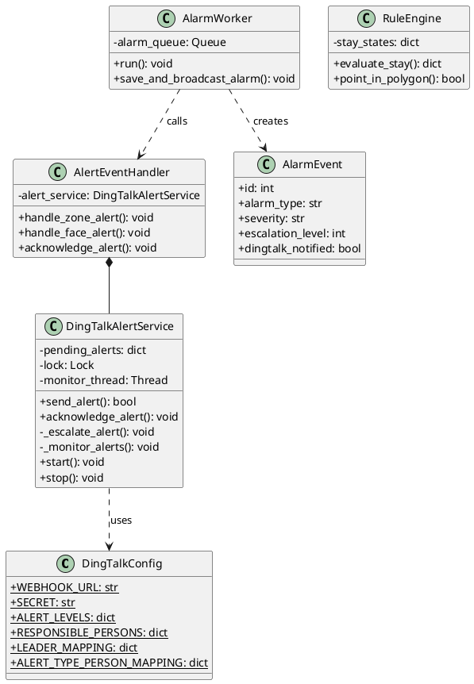
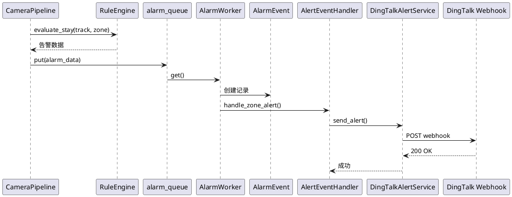

# OmniGuard 钉钉自动通知模块架构文档

## 概述

本文档描述 OmniGuard 智慧校园安防系统中钉钉自动通知模块的完整架构，包括类图、流程图、时序图的详细设计信息。

---

## 一、类图

### 1.1 类列表

| 类名 | 文件路径 | 职责 |
|------|----------|------|
| **DingTalkConfig** | services/dingtalk_alert.py | 钉钉配置管理 |
| **DingTalkAlertService** | services/dingtalk_alert.py | 钉钉告警核心服务 |
| **AlertEventHandler** | services/alert_handler.py | 告警事件处理器 |
| **RuleEngine** | core_cv/rule_engine.py | 规则引擎（围栏评估） |
| **AlarmWorker** | core_cv/pipeline.py | 告警工作线程 |
| **AlarmEvent** | models/alarm.py | 告警数据模型 |
| **alert_bp** | api/alert_api.py | 告警 API 蓝图 |

### 1.2 类的属性和方法

#### DingTalkConfig（配置类）

**属性（类变量）：**
- `WEBHOOK_URL`: 钉钉机器人 Webhook 地址
- `SECRET`: 加签密钥
- `ALERT_LEVELS`: 告警级别配置
  ```python
  {
      "critical": {"priority": 1, "name": "严重告警", "color": "红色", "timeout": 30},
      "high": {"priority": 2, "name": "高优先级", "color": "橙色", "timeout": 30},
      "medium": {"priority": 3, "name": "中优先级", "color": "黄色", "timeout": 30},
      "low": {"priority": 4, "name": "低优先级", "color": "蓝色", "timeout": 30}
  }
  ```
- `RESPONSIBLE_PERSONS`: 责任人映射
  ```python
  {
      "wang_shihan": {"phone": "13126557771", "name": "汪士涵", "level": 2},
      "gao_xing": {"phone": "18519279527", "name": "高兴", "level": 1}
  }
  ```
- `LEADER_MAPPING`: 上级领导映射
  ```python
  {"wang_shihan": "gao_xing"}
  ```
- `ALERT_TYPE_PERSON_MAPPING`: 告警类型与责任人映射
  ```python
  {
      "围栏入侵告警": "wang_shihan",
      "陌生人告警": "wang_jinghang",
      "异常活动告警": "min_shiyu"
  }
  ```

---

#### DingTalkAlertService（钉钉告警服务）

**属性：**
- `pending_alerts`: 待响应告警字典
- `lock`: 线程锁
- `monitor_thread`: 监控线程

**方法：**
- `send_alert(alert_id, alert_level, alert_type, alert_message, responsible_person_id, extra_info)`: 发送告警消息
- `acknowledge_alert(alert_id)`: 确认告警（责任人响应）
- `_escalate_alert(alert_id, alert_info)`: 再次提醒责任人（逐级上报）
- `_monitor_alerts()`: 后台监控线程，检查待响应告警
- `start()`: 启动告警服务
- `stop()`: 停止告警服务
- `_generate_sign(timestamp, secret)`: 生成钉钉加签
- `_send_message(webhook_url, message)`: 发送钉钉消息底层实现

---

#### AlertEventHandler（告警事件处理器）

**属性：**
- `alert_service`: DingTalkAlertService 实例

**方法：**
- `handle_zone_alert(zone_id, zone_name, object_id, duration, camera_id, alert_id)`: 处理围栏告警
- `handle_face_alert(user_name, confidence, camera_id)`: 处理人脸识别告警
- `acknowledge_alert(alert_id)`: 确认告警
- `start()`: 启动告警处理器
- `stop()`: 停止告警处理器

---

#### RuleEngine（规则引擎）

**属性：**
- `stay_states`: 人员停留状态字典

**方法：**
- `evaluate_stay(object_id, box_norm, zone)`: 评估对象是否在围栏内停留超时
- `point_in_polygon(point, polygon)`: 判断点是否在多边形内
- `get_center(box_norm)`: 计算边界框中心点
- `cleanup_expired_states()`: 清理过期状态

---

#### AlarmWorker（告警工作线程）

**属性：**
- `alarm_queue`: 告警队列（全局共享）
- `running`: 运行状态标志

**方法：**
- `run()`: 线程主循环，从队列消费告警
- `save_and_broadcast_alarm(item)`: 保存告警并广播推送

---

#### AlarmEvent（告警数据模型）

**属性：**
- `id`: 告警唯一标识
- `alarm_type`: 告警类型
- `severity`: 严重级别
- `camera_id`: 摄像头 ID
- `zone_id`: 围栏 ID
- `status`: 状态（pending/resolved/false_positive）
- `escalation_level`: 上报级别（0/1/2）
- `escalation_deadline`: 上报截止时间
- `dingtalk_notified`: 是否已通知钉钉
- `created_at`: 创建时间

**方法：**
- `to_dict()`: 转换为字典格式
- `should_escalate()`: 判断是否需要上报
- `escalate()`: 执行上报操作

---

### 1.3 类之间的关系

```
┌─────────────────────────────────────────────────────────────────┐
│                        检测层                                   │
│                   CameraPipeline                                │
│                                                                  │
│  - process_frame()                                               │
│  - YOLO 检测                                                     │
│  - 规则评估                                                      │
└──────────────────────────┬──────────────────────────────────────┘
                           │ 调用
                           ▼
┌─────────────────────────────────────────────────────────────────┐
│                       规则引擎层                                 │
│                      RuleEngine                                  │
│                                                                  │
│  - evaluate_stay()                                               │
│  - point_in_polygon()                                            │
│  - 判断是否触发告警                                               │
└──────────────────────────┬──────────────────────────────────────┘
                           │ 触发告警
                           ▼
┌─────────────────────────────────────────────────────────────────┐
│                       告警队列层                                 │
│                     alarm_queue                                  │
│                                                                  │
│  全局共享队列，存储待处理告警                                      │
└──────────────────────────┬──────────────────────────────────────┘
                           │ 消费
                           ▼
┌─────────────────────────────────────────────────────────────────┐
│                       告警处理层                                 │
│                      AlarmWorker                                 │
│                                                                  │
│  - save_and_broadcast_alarm()                                    │
│  - 保存到数据库                                                   │
│  - 发送 WebSocket                                                 │
│  - 发送钉钉通知                                                   │
└──────────────────────────┬──────────────────────────────────────┘
                           │ 调用
                           ▼
┌─────────────────────────────────────────────────────────────────┐
│                      事件处理层                                  │
│                   AlertEventHandler                              │
│                                                                  │
│  - handle_zone_alert()                                           │
│  - handle_face_alert()                                           │
│  - 判断告警级别                                                   │
│  - 选择责任人                                                     │
└──────────────────────────┬──────────────────────────────────────┘
                           │ 调用
                           ▼
┌─────────────────────────────────────────────────────────────────┐
│                      通知服务层                                  │
│                  DingTalkAlertService                            │
│                                                                  │
│  - send_alert()                                                  │
│  - acknowledge_alert()                                           │
│  - _escalate_alert()                                             │
│  - _monitor_alerts()                                             │
└──────────────────────────┬──────────────────────────────────────┘
                           │ 调用
                           ▼
┌─────────────────────────────────────────────────────────────────┐
│                       钉钉 API                                   │
│                   Webhook + 加签                                 │
└─────────────────────────────────────────────────────────────────┘
```

**依赖关系总结：**

| 调用方 | 被调用方 | 关系类型 |
|--------|----------|----------|
| CameraPipeline | RuleEngine | 依赖 |
| CameraPipeline | alarm_queue | 依赖 |
| AlarmWorker | AlarmEvent | 依赖 |
| AlarmWorker | AlertEventHandler | 依赖 |
| AlertEventHandler | DingTalkAlertService | 组合 |
| DingTalkAlertService | DingTalkConfig | 依赖 |
| DingTalkAlertService | 钉钉 Webhook | 依赖 |

---

## 二、流程图

### 2.1 钉钉告警主流程（带泳道）

**泳道划分：**

| 泳道 | 组件 | 职责 |
|------|------|------|
| 检测层 | CameraPipeline | 视频流处理和目标检测 |
| 规则层 | RuleEngine | 规则评估和告警触发 |
| 队列层 | alarm_queue | 告警缓冲队列 |
| 处理层 | AlarmWorker | 告警保存和分发 |
| 通知层 | DingTalkAlertService | 钉钉消息发送 |
| 监控层 | 监控线程 | 逐级上报检查 |

**流程步骤：**

```
┌─────────────────────────────────────────────────────────────────────────────┐
│                              [开始]                                          │
│                         视频流实时处理                                        │
└─────────────────────────────────────────────────────────────────────────────┘
                                      │
                                      ▼
┌─────────────────────────────────────────────────────────────────────────────┐
│ 【检测层】CameraPipeline.process_frame()                                      │
│                                                                              │
│   ① YOLO 检测人员目标                                                        │
│      persons = yolo_detector.detect(frame)                                  │
│                                                                              │
│   ② 目标跟踪                                                                 │
│      tracks = tracker.update(persons)                                       │
└─────────────────────────────────────────────────────────────────────────────┘
                                      │
                                      ▼
┌─────────────────────────────────────────────────────────────────────────────┐
│ 【规则层】RuleEngine.evaluate_stay()                                          │
│                                                                              │
│   ③ 遍历每个跟踪目标                                                         │
│      for track in tracks:                                                   │
│          for zone in zones:                                                 │
│              ┌─────────────────────────────────────┐                        │
│              │ 人员是否在围栏内？                   │                        │
│              │ point_in_polygon(center, zone)       │                        │
│              └─────────────────────────────────────┘                        │
│                      │               │                                        │
│                      │ 是            │ 否                                     │
│                      ▼               │                                        │
│              记录停留时间           │                                        │
│                      │               │                                        │
│                      ▼               │                                        │
│              ┌─────────────────────────────────────┐                        │
│              │ 停留时间 > 阈值？                   │                        │
│              └─────────────────────────────────────┘                        │
│                      │               │                                        │
│                      │ 是            │ 否                                     │
│                      ▼               ▼                                        │
│              触发告警           继续监控                                    │
└─────────────────────────────────────────────────────────────────────────────┘
                                      │
                                      ▼
┌─────────────────────────────────────────────────────────────────────────────┐
│ 【队列层】告警入队                                                             │
│                                                                              │
│   ④ 创建告警数据                                                             │
│      alarm_data = {                                                         │
│          "alarm_type": "electronic_fence",                                  │
│          "camera_id": camera_id,                                            │
│          "zone_id": zone_id,                                                │
│          "severity": severity,                                              │
│          "description": "...",                                              │
│          "snapshot_frame": frame                                            │
│      }                                                                       │
│                                                                              │
│   ⑤ 放入告警队列                                                             │
│      alarm_queue.put_nowait(alarm_data)                                     │
└─────────────────────────────────────────────────────────────────────────────┘
                                      │
                                      ▼
┌─────────────────────────────────────────────────────────────────────────────┐
│ 【处理层】AlarmWorker.save_and_broadcast_alarm()                              │
│                                                                              │
│   ⑥ 保存快照图片                                                             │
│      filename = f"alarm_{alarm_id}_{timestamp}.jpg"                         │
│      cv2.imwrite(f"static/snapshots/{filename}", snapshot_frame)            │
│                                                                              │
│   ⑦ 创建 AlarmEvent 数据库记录                                               │
│      alarm = AlarmEvent(                                                    │
│          alarm_type="electronic_fence",                                     │
│          severity=severity,                                                 │
│          camera_id=camera_id,                                               │
│          zone_id=zone_id,                                                   │
│          snapshot_url=snapshot_path,                                        │
│          status="pending"                                                   │
│      )                                                                       │
│      db.session.add(alarm)                                                  │
│      db.session.commit()                                                    │
│                                                                              │
│   ⑧ 发送 WebSocket 通知                                                      │
│      emit_alarm(alarm.to_dict())                                            │
└─────────────────────────────────────────────────────────────────────────────┘
                                      │
                                      ▼
┌─────────────────────────────────────────────────────────────────────────────┐
│ 【处理层】AlertEventHandler.handle_zone_alert()                               │
│                                                                              │
│   ⑨ 根据停留时长判断告警级别                                                  │
│      ┌─────────────────────────────────────┐                                │
│      │ duration > 300秒 (5分钟) ?          │                                │
│      └─────────────────────────────────────┘                                │
│              │               │                                                │
│              │ 是            │ 否                                             │
│              ▼               ▼                                                │
│      alert_level="critical"  ┌─────────────────────────────────────┐        │
│                              │ duration > 180秒 (3分钟) ?          │        │
│                              └─────────────────────────────────────┘        │
│                                      │               │                      │
│                                      │ 是            │ 否                   │
│                                      ▼               ▼                      │
│                              alert_level="high"  ┌─────────────────────┐    │
│                                                  │ duration > 60秒 ?    │    │
│                                                  └─────────────────────┘    │
│                                                          │           │        │
│                                                          │ 是        │ 否     │
│                                                          ▼           ▼        │
│                                                  alert_level="medium" "low" │
│                                                                              │
│   ⑩ 自动选择责任人                                                           │
│      responsible_person = ALERT_TYPE_PERSON_MAPPING["围栏入侵告警"]          │
│      → "wang_shihan" (汪士涵)                                                │
└─────────────────────────────────────────────────────────────────────────────┘
                                      │
                                      ▼
┌─────────────────────────────────────────────────────────────────────────────┐
│ 【通知层】DingTalkAlertService.send_alert()                                   │
│                                                                              │
│   ⑪ 生成钉钉加签                                                             │
│      timestamp = str(int(time.time() * 1000))                               │
│      string_to_sign = f"{timestamp}\n{secret}"                              │
│      hmac_code = hmac.new(secret.encode(), string_to_sign.encode(),         │
│                          digestmod=hashlib.sha256).digest()                 │
│      sign = base64.b64encode(hmac_code).decode()                            │
│                                                                              │
│   ⑫ 构建消息体                                                               │
│      message = {                                                            │
│          "msgtype": "markdown",                                             │
│          "markdown": {                                                      │
│              "title": "【高优先级】围栏入侵告警",                              │
│              "text": "### 【高优先级】围栏入侵告警\n\n                        │
│                       **告警级别：** 高优先级\n\n                            │
│                       **告警类型：** 围栏入侵告警\n\n                        │
│                       **告警时间：** 2026-07-13 11:30:00\n\n                │
│                       **告警详情：** 人员(ID:123)在围栏【禁区A】内停留180.5秒\n\n │
│                       **责任人：** @汪士涵"                                  │
│          },                                                                 │
│          "at": {                                                            │
│              "atMobiles": ["13126557771"],                                  │
│              "isAtAll": false                                               │
│          }                                                                  │
│      }                                                                       │
│                                                                              │
│   ⑬ 发送钉钉消息                                                             │
│      webhook_url = f"{webhook_url}&timestamp={timestamp}&sign={sign}"       │
│      requests.post(webhook_url, json=message)                               │
│                                                                              │
│   ⑭ 记录待响应告警                                                           │
│      pending_alerts[alert_id] = {                                           │
│          "alert_info": alert_info,                                          │
│          "send_time": time.time(),                                          │
│          "escalation_count": 0                                              │
│      }                                                                       │
└─────────────────────────────────────────────────────────────────────────────┘
                                      │
                                      ▼
┌─────────────────────────────────────────────────────────────────────────────┐
│ 【监控层】_monitor_alerts() [后台线程，每10秒检查一次]                          │
│                                                                              │
│   ⑮ 遍历待响应告警                                                           │
│      for alert_id, alert_info in pending_alerts.items():                   │
│          elapsed = time.time() - alert_info["send_time"]                    │
│                                                                              │
│          ┌─────────────────────────────────────┐                            │
│          │ elapsed > 30秒 (超时) ?             │                            │
│          └─────────────────────────────────────┘                            │
│                  │               │                                            │
│                  │ 是            │ 否                                         │
│                  ▼               │                                            │
│          触发逐级上报           │                                            │
│          _escalate_alert()      │                                            │
│                  │               │                                            │
│                  ▼               │                                            │
│          ┌─────────────────────────────────────┐                            │
│          │ escalation_count < 2 ?              │                            │
│          └─────────────────────────────────────┘                            │
│                  │               │                                            │
│                  │ 是            │ 否                                         │
│                  ▼               ▼                                            │
│          再次发送消息       停止上报                                        │
│          @责任人 + @上级领导                                                 │
│          escalation_count++                                                  │
└─────────────────────────────────────────────────────────────────────────────┘
                                      │
                                      ▼
┌─────────────────────────────────────────────────────────────────────────────┐
│                              [结束]                                          │
│                         等待告警确认                                          │
└─────────────────────────────────────────────────────────────────────────────┘
```

---

### 2.2 逐级上报子流程

```
┌─────────────────────────────────────────────────────────────────────────────┐
│              [开始: _escalate_alert(alert_id, alert_info)]                   │
└─────────────────────────────────────────────────────────────────────────────┘
                                      │
                                      ▼
┌─────────────────────────────────────────────────────────────────────────────┐
│ ① 获取责任人信息                                                             │
│    responsible_person_id = alert_info["responsible_person_id"]              │
│    person_info = RESPONSIBLE_PERSONS[responsible_person_id]                 │
└─────────────────────────────────────────────────────────────────────────────┘
                                      │
                                      ▼
┌─────────────────────────────────────────────────────────────────────────────┐
│ ② 获取上级领导                                                               │
│    leader_id = LEADER_MAPPING.get(responsible_person_id)                    │
│    leader_info = RESPONSIBLE_PERSONS[leader_id] if leader_id else None      │
└─────────────────────────────────────────────────────────────────────────────┘
                                      │
                                      ▼
┌─────────────────────────────────────────────────────────────────────────────┐
│ ③ 构建升级消息                                                               │
│    message = {                                                              │
│        "msgtype": "markdown",                                               │
│        "markdown": {                                                        │
│            "title": "【再次提醒】围栏入侵告警",                                │
│            "text": "... \n\n **紧急提醒：请尽快处理！** \n\n @责任人 @上级领导" │
│        },                                                                   │
│        "at": {                                                              │
│            "atMobiles": [person_phone, leader_phone],                       │
│            "isAtAll": false                                                 │
│        }                                                                    │
│    }                                                                         │
└─────────────────────────────────────────────────────────────────────────────┘
                                      │
                                      ▼
┌─────────────────────────────────────────────────────────────────────────────┐
│ ④ 发送升级消息                                                               │
│    _send_message(webhook_url, message)                                      │
└─────────────────────────────────────────────────────────────────────────────┘
                                      │
                                      ▼
┌─────────────────────────────────────────────────────────────────────────────┐
│ ⑤ 更新上报计数                                                               │
│    alert_info["escalation_count"] += 1                                      │
│    alert_info["send_time"] = time.time()  # 重置计时                        │
└─────────────────────────────────────────────────────────────────────────────┘
                                      │
                                      ▼
┌─────────────────────────────────────────────────────────────────────────────┐
│                              [结束]                                          │
└─────────────────────────────────────────────────────────────────────────────┘
```

---

### 2.3 告警确认流程

```
┌─────────────────────────────────────────────────────────────────────────────┐
│              [开始: acknowledge_alert(alert_id)]                             │
└─────────────────────────────────────────────────────────────────────────────┘
                                      │
                                      ▼
┌─────────────────────────────────────────────────────────────────────────────┐
│ ① 检查告警是否存在                                                           │
│    ┌─────────────────────────────────────┐                                  │
│    │ alert_id in pending_alerts ?        │                                  │
│    └─────────────────────────────────────┘                                  │
│            │               │                                                │
│            │ 是            │ 否                                             │
│            ▼               ▼                                                │
│    继续处理           返回错误                                            │
└─────────────────────────────────────────────────────────────────────────────┘
                                      │
                                      ▼
┌─────────────────────────────────────────────────────────────────────────────┐
│ ② 从待响应列表移除                                                           │
│    with lock:                                                               │
│        del pending_alerts[alert_id]                                         │
└─────────────────────────────────────────────────────────────────────────────┘
                                      │
                                      ▼
┌─────────────────────────────────────────────────────────────────────────────┐
│ ③ 更新数据库状态                                                             │
│    alarm = AlarmEvent.query.get(alert_id)                                   │
│    alarm.status = "resolved"                                                │
│    db.session.commit()                                                      │
└─────────────────────────────────────────────────────────────────────────────┘
                                      │
                                      ▼
┌─────────────────────────────────────────────────────────────────────────────┐
│                              [结束]                                          │
└─────────────────────────────────────────────────────────────────────────────┘
```

---

## 三、时序图

### 3.1 围栏告警触发到钉钉通知完整时序

**参与者：**
- CameraPipeline: 摄像头处理管道
- RuleEngine: 规则引擎
- alarm_queue: 告警队列
- AlarmWorker: 告警工作线程
- AlarmEvent: 告警数据模型
- AlertEventHandler: 告警事件处理器
- DingTalkAlertService: 钉钉告警服务
- DingTalk Webhook: 钉钉 API

**时序：**

```
┌──────────────┐ ┌───────────┐ ┌────────────┐ ┌───────────┐ ┌───────────┐ ┌────────────────┐ ┌─────────────────┐ ┌──────────────┐
│CameraPipeline│ │RuleEngine │ │alarm_queue │ │AlarmWorker│ │ AlarmEvent│ │AlertEventHandler│ │DingTalkService │ │DingTalkWebhook│
└──────┬───────┘ └─────┬─────┘ └─────┬──────┘ └─────┬─────┘ └─────┬─────┘ └───────┬────────┘ └───────┬─────────┘ └──────┬───────┘
       │               │               │              │             │               │                  │                 │
       │ process_frame()│               │              │             │               │                  │                 │
       │               │               │              │             │               │                  │                 │
       │ evaluate_stay(track, zone)    │              │             │               │                  │                 │
       │──────────────>│               │              │             │               │                  │                 │
       │               │               │              │             │               │                  │                 │
       │               │ 判断停留超时   │              │             │               │                  │                 │
       │               │               │              │             │               │                  │                 │
       │               │ 返回告警数据   │              │             │               │                  │                 │
       │<──────────────│               │              │             │               │                  │                 │
       │               │               │              │             │               │                  │                 │
       │ put(alarm_data)│              │              │             │               │                  │                 │
       │───────────────────────────────>│              │             │               │                  │                 │
       │               │               │              │             │               │                  │                 │
       │               │               │ get()        │             │               │                  │                 │
       │               │               │─────────────>│             │               │                  │                 │
       │               │               │              │             │               │                  │                 │
       │               │               │ alarm_data   │             │               │                  │                 │
       │               │               │<─────────────│             │               │                  │                 │
       │               │               │              │             │               │                  │                 │
       │               │               │              │ 创建记录     │               │                  │                 │
       │               │               │              │─────────────>│               │                  │                 │
       │               │               │              │             │               │                  │                 │
       │               │               │              │ alarm_id     │               │                  │                 │
       │               │               │              │<─────────────│               │                  │                 │
       │               │               │              │             │               │                  │                 │
       │               │               │              │ handle_zone_alert()          │                  │                 │
       │               │               │              │─────────────────────────────>│                  │                 │
       │               │               │              │             │               │                  │                 │
       │               │               │              │             │ 判断告警级别   │                  │                 │
       │               │               │              │             │ 选择责任人     │                  │                 │
       │               │               │              │             │               │                  │                 │
       │               │               │              │             │ send_alert()  │                  │                 │
       │               │               │              │             │─────────────────────────────────>│                 │
       │               │               │              │             │               │                  │                 │
       │               │               │              │             │               │ 生成加签         │                 │
       │               │               │              │             │               │ 构建消息体       │                 │
       │               │               │              │             │               │                  │                 │
       │               │               │              │             │               │ POST webhook     │                 │
       │               │               │              │             │               │──────────────────────────────────────>│
       │               │               │              │             │               │                  │                 │
       │               │               │              │             │               │ 200 OK           │                 │
       │               │               │              │             │               │<──────────────────────────────────────│
       │               │               │              │             │               │                  │                 │
       │               │               │              │             │               │ 记录待响应告警   │                 │
       │               │               │              │             │               │                  │                 │
       ▼               ▼               ▼              ▼             ▼               ▼                  ▼                 ▼
```

---

### 3.2 逐级上报时序

**参与者：**
- 监控线程: _monitor_alerts()
- DingTalkAlertService: 钉钉告警服务
- DingTalk Webhook: 钉钉 API

**时序：**

```
┌────────────┐ ┌─────────────────┐ ┌──────────────┐
│ 监控线程   │ │DingTalkService │ │DingTalkWebhook│
└─────┬──────┘ └───────┬─────────┘ └──────┬───────┘
      │                  │                 │
      │ 每10秒检查       │                 │
      │                  │                 │
      │ 遍历 pending_alerts                │
      │                  │                 │
      │ 发现超时告警      │                 │
      │ (elapsed > 30秒) │                 │
      │                  │                 │
      │ _escalate_alert()│                 │
      │─────────────────>│                 │
      │                  │                 │
      │                  │ 获取责任人信息   │
      │                  │ 获取上级领导     │
      │                  │ 构建升级消息     │
      │                  │                 │
      │                  │ POST webhook    │
      │                  │────────────────>│
      │                  │                 │
      │                  │ 200 OK          │
      │                  │<────────────────│
      │                  │                 │
      │                  │ 更新上报计数     │
      │                  │ 重置计时         │
      │                  │                 │
      ▼                  ▼                 ▼
```

---

## 四、关键技术特性

### 4.1 钉钉加签机制

**安全验证流程：**

```python
# 1. 生成时间戳
timestamp = str(int(time.time() * 1000))

# 2. 拼接签名字符串
string_to_sign = f"{timestamp}\n{secret}"

# 3. HMAC-SHA256 加密
hmac_code = hmac.new(
    secret.encode('utf-8'),
    string_to_sign.encode('utf-8'),
    digestmod=hashlib.sha256
).digest()

# 4. Base64 编码
sign = base64.b64encode(hmac_code).decode('utf-8')

# 5. 拼接 Webhook URL
webhook_url = f"{webhook_url}&timestamp={timestamp}&sign={sign}"
```

### 4.2 告警级别判断

| 停留时长 | 告警级别 | 优先级 |
|----------|----------|--------|
| > 300秒 (5分钟) | critical | 1 (最高) |
| > 180秒 (3分钟) | high | 2 |
| > 60秒 (1分钟) | medium | 3 |
| 其他 | low | 4 (最低) |

### 4.3 责任人映射

| 告警类型 | 责任人 ID | 姓名 | 手机号 |
|----------|-----------|------|--------|
| 围栏入侵告警 | wang_shihan | 汪士涵 | 13126557771 |
| 陌生人告警 | wang_jinghang | 王靖杭 | - |
| 异常活动告警 | min_shiyu | 闵世宇 | - |
| 测试告警 | gao_xing | 高兴 | 18519279527 |

### 4.4 逐级上报配置

| 配置项 | 值 | 说明 |
|--------|-----|------|
| 首次告警超时 | 30秒 | 30秒未响应触发上报 |
| 最大上报级别 | 2级 | 最多上报2次 |
| 监控检查间隔 | 10秒 | 每10秒检查一次待响应告警 |

### 4.5 线程安全设计

```python
class DingTalkAlertService:
    def __init__(self):
        self.pending_alerts = {}
        self.lock = threading.Lock()  # 线程锁
    
    def send_alert(self, ...):
        with self.lock:  # 加锁
            self.pending_alerts[alert_id] = alert_info
    
    def acknowledge_alert(self, alert_id):
        with self.lock:  # 加锁
            if alert_id in self.pending_alerts:
                del self.pending_alerts[alert_id]
```

---

## 五、API 接口说明

### 5.1 接口列表

| 方法 | 路径 | 说明 |
|------|------|------|
| POST | /api/alerts/send | 发送告警 |
| POST | /api/alerts/acknowledge | 确认告警 |
| GET | /api/alerts/pending | 获取待响应告警列表 |
| POST | /api/alerts/test | 测试钉钉告警 |

### 5.2 请求/响应示例

**发送告警：**
```json
// POST /api/alerts/send
// Request
{
  "alert_level": "high",
  "alert_type": "围栏入侵告警",
  "alert_message": "人员(ID:123)在围栏【禁区A】内停留180.5秒",
  "responsible_person_id": "wang_shihan",
  "extra_info": {
    "camera": "cam-1",
    "zone": "禁区A"
  }
}

// Response
{
  "code": 0,
  "message": "告警发送成功",
  "data": {
    "alert_id": "alert_20260713_113000",
    "status": "sent"
  }
}
```

**确认告警：**
```json
// POST /api/alerts/acknowledge
// Request
{
  "alert_id": "alert_20260713_113000"
}

// Response
{
  "code": 0,
  "message": "告警已确认"
}
```

---

## 六、消息格式示例

### 6.1 Markdown 消息格式

```json
{
  "msgtype": "markdown",
  "markdown": {
    "title": "【高优先级】围栏入侵告警",
    "text": "### 【高优先级】围栏入侵告警\n\n**告警级别：** 高优先级\n\n**告警类型：** 围栏入侵告警\n\n**告警时间：** 2026-07-13 11:30:00\n\n**摄像头：** cam-1 (前门摄像头)\n\n**告警详情：** 人员(ID:123)在围栏【禁区A】内停留180.5秒\n\n**责任人：** @汪士涵\n\n---\n\n请尽快处理！"
  },
  "at": {
    "atMobiles": ["13126557771"],
    "isAtAll": false
  }
}
```

### 6.2 升级消息格式

```json
{
  "msgtype": "markdown",
  "markdown": {
    "title": "【再次提醒】围栏入侵告警",
    "text": "### 【再次提醒】围栏入侵告警\n\n**告警级别：** 高优先级\n\n**告警类型：** 围栏入侵告警\n\n**告警时间：** 2026-07-13 11:30:00\n\n**已等待：** 30秒\n\n**告警详情：** 人员(ID:123)在围栏【禁区A】内停留180.5秒\n\n**责任人：** @汪士涵\n\n**上级领导：** @高兴\n\n---\n\n⚠️ **紧急提醒：请尽快处理！**"
  },
  "at": {
    "atMobiles": ["13126557771", "18519279527"],
    "isAtAll": false
  }
}
```

---

## 七、附录：PlantUML 代码示例

### 7.1 类图



### 7.2 时序图



---

**文档版本**: v1.0  
**最后更新**: 2026-07-13  
**作者**: OmniGuard 开发团队